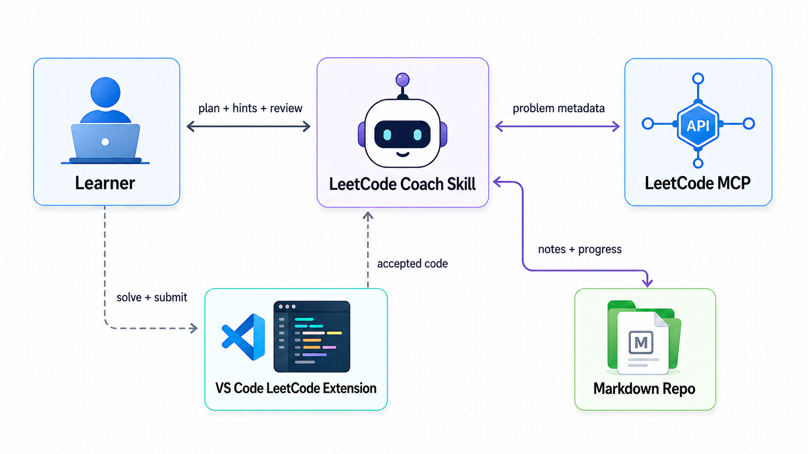

# LeetCode Coach

An agent-assisted LeetCode practice workspace for planning sessions, solving in VS Code, getting coached through mistakes, and turning accepted solutions into durable Markdown notes.

LeetCode Coach is a template repository. You solve with the VS Code LeetCode extension, Codex coaches the session, LeetCode MCP fetches metadata on demand, and Markdown keeps the long-term learning record.



## Features

- **Coaching loop**: resume progress, choose a route, give progressive hints, review code, and record outcomes.
- **VS Code submit flow**: use the LeetCode extension for Test and Submit while keeping plugin files out of Git.
- **Per-problem notes**: each problem owns its metadata, reasoning, mistakes, review log, and archived solution.
- **Progressive disclosure**: the coach starts from compact state instead of loading every note.
- **List-friendly practice**: support Hot 100, topic lists, Daily, and review routes without one giant JSON file.

## How It Works

The learner writes and submits code through the VS Code LeetCode extension. The coach plans, hints, reviews, and records. LeetCode MCP provides live problem metadata. The Markdown repo stores notes, sessions, patterns, and accepted solutions.

`workspace/leetcode/` is the ignored submit workspace. `problems/.../note.md` and `solution.py` are the durable study record.

## Quick Start

1. Use this repository as a template or clone it.
2. Open the repo in VS Code.
3. Install and sign in to the VS Code LeetCode extension.
4. Configure LeetCode MCP in Codex if it is not already available.
5. Start a Codex session in this repository:

```text
用 leetcode-coach，今天开始 LeetCode 训练。
```

The coach should summarize your current progress, recommend a route, fetch the selected problem through MCP, guide the solve, review your code, and update the second brain after AC.

## Daily Workflow

1. Start a Codex session and invoke `leetcode-coach`.
2. Choose a route: active list, due review, Daily, or topic.
3. Let the coach fetch metadata and initialize the local note.
4. Solve in the VS Code LeetCode extension under `workspace/leetcode/`.
5. Ask for hints, edge-case checks, complexity review, or code review when needed.
6. After AC, tell the coach so it can archive the code, update notes, and schedule review.

## Repository Structure

```text
.codex/skills/leetcode-coach/  # Project Skill, references, and bundled automation
.vscode/settings.json          # VS Code LeetCode project settings
knowledge/patterns/            # Reusable pattern notes
lists/                         # Study lists by LeetCode slug
problems/                      # One directory per initialized problem
study/goals.md                 # Learning goals and current focus
study/profile.json             # Preferences and active list
study/sessions/                # Daily session logs
templates/                     # Note/session/pattern/code templates
workspace/leetcode/            # Ignored VS Code LeetCode submit workspace
```

Problem folders are grouped by frontend ID:

```text
problems/
  0000-0999/
    0001-two-sum/
      note.md
      solution.py
```

## Data Model

Each `note.md` starts with a small JSON metadata block:

```md
<!-- leetcode-meta
{
  "id": 1,
  "slug": "two-sum",
  "title": "Two Sum",
  "difficulty": "Easy",
  "tags": ["array", "hash-table"],
  "lists": ["my-list"],
  "status": "Todo",
  "mastery": "new",
  "last_practiced": null,
  "next_review": null,
  "mistake_tags": []
}
-->
```

That metadata is the source of truth for progress. Lists are views, sessions are logs, and pattern notes are reusable knowledge. The detailed asset contract lives inside the Skill references.

## VS Code LeetCode Integration

This repo includes project-level settings for the VS Code LeetCode extension:

```json
{
  "leetcode.workspaceFolder": "${workspaceFolder}/workspace/leetcode",
  "leetcode.filePath": "${id}.${kebab-case-name}.${ext}",
  "leetcode.defaultLanguage": "python3",
  "leetcode.endpoint": "leetcode-cn"
}
```

Plugin-generated files are intentionally ignored by Git. They are for online judge interaction only. The coach archives the accepted code into the matching problem directory after you report AC.

## Study Lists

Create Markdown lists under `lists/`:

```md
# Hash Table Practice

- `two-sum`
- `group-anagrams`
```

Set `active_list` in `study/profile.json`, or ask the coach to switch routes. A problem can appear in multiple lists while still keeping one canonical note.

## Privacy And Copyright

- This is not an official LeetCode project.
- This is not a problem mirror, auto-solver, or auto-submitter.
- Do not commit LeetCode cookies, CSRF tokens, or session values.
- Do not commit full LeetCode problem statements copied from the site.
- Store links, metadata, your own explanations, your own mistakes, and your own solutions.
- LeetCode content is governed by [LeetCode Terms](https://leetcode.com/terms).

## License

Add a license before publishing this as a public template.
